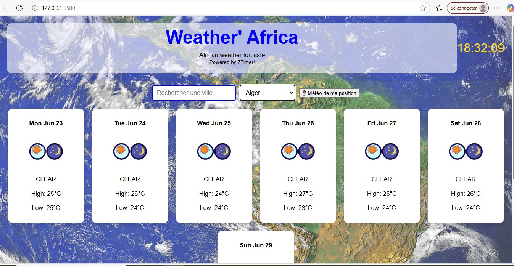

# 🌍 Weather' Africa



An interactive web application that displays 7-day weather forecasts for African cities. Built with HTML, CSS, and JavaScript, it uses the 7Timer! API and includes CSV-based city selection, autocomplete, timezone-based clocks, and geolocation support.

---

## 🔎 Project Overview

Weather' Africa is a weather web app focused on African cities. It allows users to:
- Select a city from a dynamic dropdown,
- Search with instant suggestions,
- View 7-day forecasts with icons,
- See the local time of each city,
- Or detect their current location for automatic weather display.

It’s responsive, fast, and fully client-side.

---

## 🚀 Features

- 🗺️ Dynamic city list loaded from CSV
- 🔍 Autocomplete city search
- 📆 7-day weather forecast via the 7Timer! API
- 🕒 Live local time based on timezone
- 📍 Weather based on your current location
- 📱 Responsive layout (mobile & desktop)

---

## 🧰 Technologies Used

- HTML5, CSS3, Vanilla JavaScript
- [7Timer! Weather API](http://www.7timer.info)
- PapaParse.js for parsing CSV files
- Geolocation API
- DOM manipulation & async JS (fetch, event handling)

---

## 🧠 Approach & Solution

- The city list is parsed from a CSV using PapaParse and displayed in a `<select>` dropdown.
- Autocomplete suggestions come from a separate search box linked to the same city list.
- Selecting a city (or using geolocation) triggers an API call to 7Timer! with latitude/longitude.
- The app displays weather cards for the next 7 days with icons, temperatures, and weather types.
- A live digital clock is shown based on the city's timezone using `toLocaleString()`.

This modular architecture makes it easy to maintain, scale, and reuse in other contexts.

---

## 🖼️ Project Structure

📁 css/
└── master.css
📁 js/
└── main.js
📁 images/
└── [weather icons like clear.png, cloudy.png, etc.]
📄 index.html
📄 city_coordinates.csv
📄 README.md


---


🌐 Live Demo
Coming soon…
(You can host it via GitHub Pages and add the link here)
Example: https://yourusername.github.io/weather-africa-app
---


## ⚙️ Installation

1. Clone the repository
```bash
git clone https://github.com/yourusername/weather-africa-app.git
cd weather-africa-app
```

👤 Author
---
Alfran Essone

📄 License
---
This project is licensed under the MIT License.
You are free to reuse, modify, and share with proper attribution.

